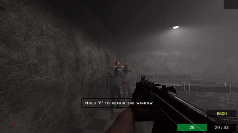
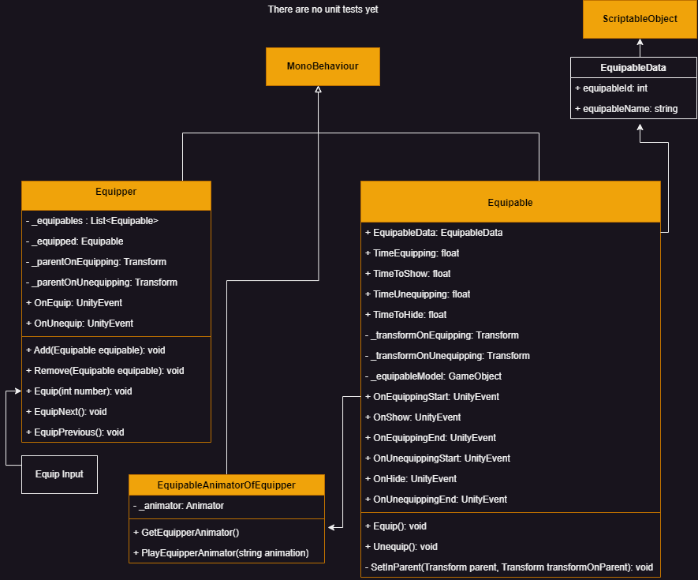
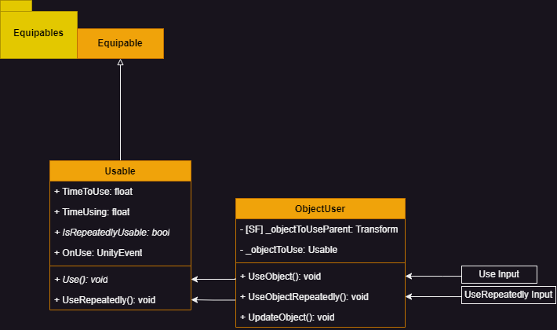
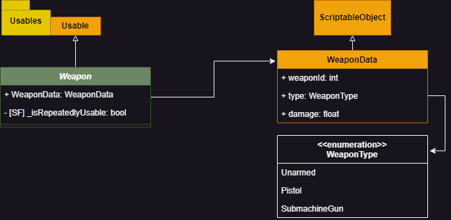
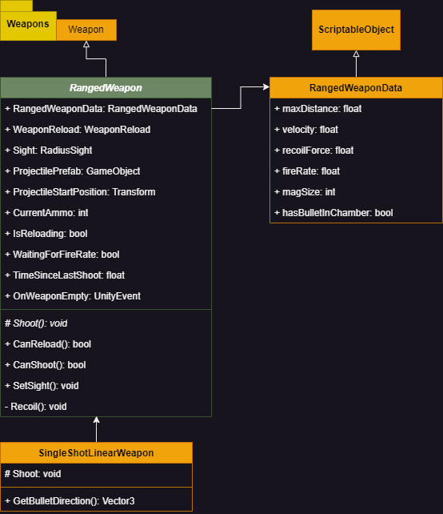
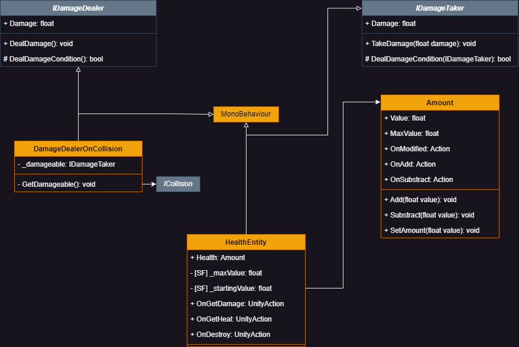

# Prevail

Prevail is a first-person shooter in which you'll have to survive waves of zombies.

[Download it here](https://mateoryhr.itch.io/prevail)

[Look this gameplay](https://youtu.be/3eZuvO2aXho)

# Systems

> Index 

1. ## [Input](#01)
2. ## [Movement](#02)
3. ## [Animation Controller](#03)
4. ## [Equipables](#04)
5. ## [Usables](#05)
6. ## [Weapons](#06)
7. ## [RangedWeapons](#07)
08. ## [Health](#08)

> End of index

1. ## Input 

[Go to index](#i)

2. ## Movement 

[Go to index](#i)

3. ## Animation 

[Go to index](#i)

4. ## Equipables 

[Go to index](#i)

5. ## Usables 

[Go to index](#i)

6. ## Weapons 

[Go to index](#i)

7. ## RangedWeapons 

[Go to index](#i)

8. ## Health 

[Go to index](#i)
